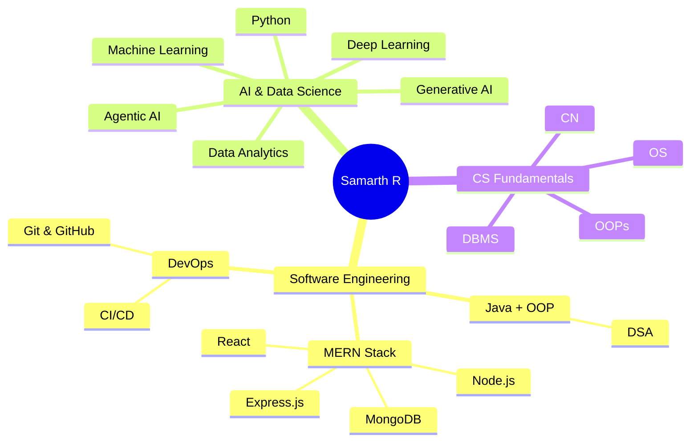

<div align="center">

<!-- 3D Animated Header Banner -->


<!-- Animated Typing -->
<a href="https://git.io/typing-svg">
  
</a>


<!-- Social Links -->
<p>
  <a href="https://samarth-r.vercel.app/" target="_blank">
    
  </a>
  <a href="https://linkedin.com/in/samarth-r-978162396" target="_blank">
    
  </a>
  <a href="https://twitter.com/_samarth_r" target="_blank">
    
  </a>
  <a href="mailto:samarthr.tech@gmail.com">
    
  </a>
</p>

</div>

<!-- Animated Divider -->


##  **About Me**


```yaml
name: Samarth R
located_in: Mysuru, Karnataka, India
education:
  university: The National Institute of Engineering
  degree: B.E. Computer Science & Engineering
  batch: 2025 - 2029

current_focus:
  - Full-Stack Development (MERN)
  - Data Structures & Algorithms (Java)
  - Machine Learning & AI
  - Open Source Contributions

goal: "Become a strong AI Software Engineer who builds
       scalable systems with modern AI technologies"

```

<br clear="both"/>

<!-- Animated Divider -->


##  **Tech Arsenal**

<div align="center">

### 🔥 Core & OOP Languages
<p>
  <a href="#"></a>
  <a href="#"></a>
  <a href="#"></a>
  <a href="#"></a>
  <a href="#"></a>
</p>

### 🌐 Web Development (MERN Stack) — BY THE END OF 2026
<p>
  <a href="#"></a>
  <a href="#"></a>
  <a href="#"></a>
  <a href="#"></a>
  <a href="#"></a>
  <a href="#"></a>
</p>

### ⚙️ Tools & Platforms
<p>
  <a href="#"></a>
  <a href="#"></a>
  <a href="#"></a>
  <a href="#"></a>
  <a href="#"></a>
</p>

### 🧠 AI / ML — Exploring
<p>
  <a href="#"></a>
  <a href="#"></a>
  <a href="#"></a>
  <a href="#"></a>
</p>

</div>

<!-- Animated Divider -->


## 🗺️ **Learning Roadmap**



<!-- Animated Divider -->


## 📊 **GitHub Analytics**

<div align="center">

<!-- GitHub Stats Card -->
<a href="https://github.com/r-samarth">
  
</a>
<a href="https://github.com/r-samarth">
  
</a>

<!-- GitHub Streak Stats -->
<br/><br/>
<a href="https://github.com/r-samarth">
  
</a>

<!-- Activity Graph -->
<br/><br/>
<a href="https://github.com/r-samarth">
  
</a>

</div>

<!-- Animated Divider -->


## 🏆 **GitHub Trophies**

<div align="center">
  
</div>

<!-- Animated Divider -->


## 🎯 **2026–27 Roadmap**

<div align="center">

| 🚩 Goal | 📌 Status |
|---------|-----------|
| ✅ Complete MERN learning path | 🔄 In Progress |
| 🏗️ Build & deploy full-stack projects | 🔄 In Progress |
| 💪 Strengthen Java & DSA fundamentals | 🔄 In Progress |
| 🧱 Build solid CS foundations | 🔄 In Progress |
| 🌍 Start Open Source contributions | 📋 Planned |
| 🎖️ Prepare for **GSoC 2027** | 📋 Planned |
| 🤖 ML → DL → GenAI → Agentic AI | 📋 Planned |
| 📈 Grow as a Software Engineer | ♾️ Always |

</div>

<!-- Animated Divider -->


## 🐍 **Contribution Snake**

<div align="center">
  <picture>
    <source media="(prefers-color-scheme: dark)" srcset="https://raw.githubusercontent.com/r-samarth/r-samarth/output/github-snake-dark.svg" />
    <source media="(prefers-color-scheme: light)" srcset="https://raw.githubusercontent.com/r-samarth/r-samarth/output/github-snake.svg" />
    
  </picture>
</div>

<!-- Animated Divider -->


## 💬 **Random Dev Quote**

<div align="center">
  
</div>

<br/>

<!-- Animated Divider -->


<div align="center">

### 🤝 Let's Connect & Build Together!

<p>
  <i>I'm always open to collaborating on interesting projects, contributing to open source, and connecting with fellow developers. Let's learn and grow together!</i>
</p>

<a href="https://samarth-r.vercel.app/" target="_blank">
  
</a>

<br/><br/>


</div>
